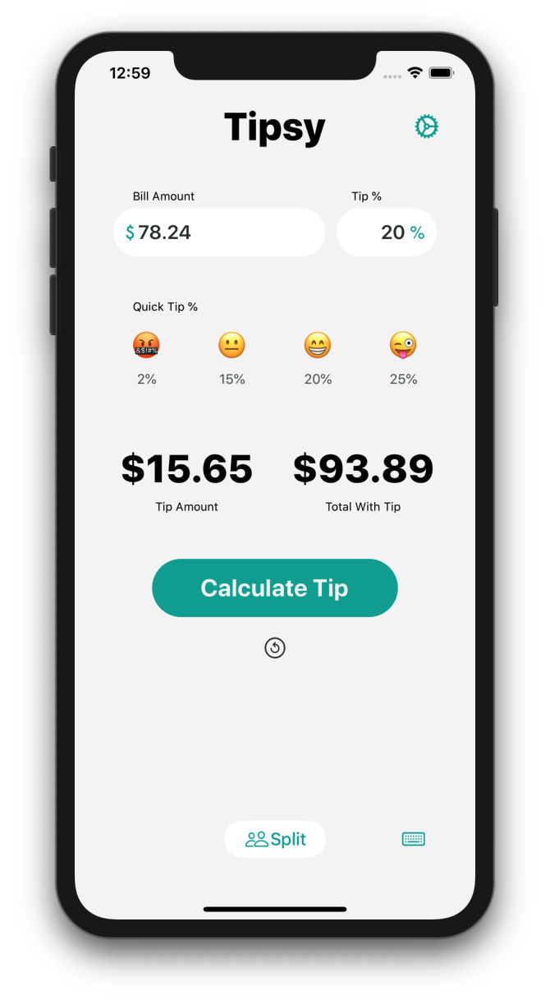
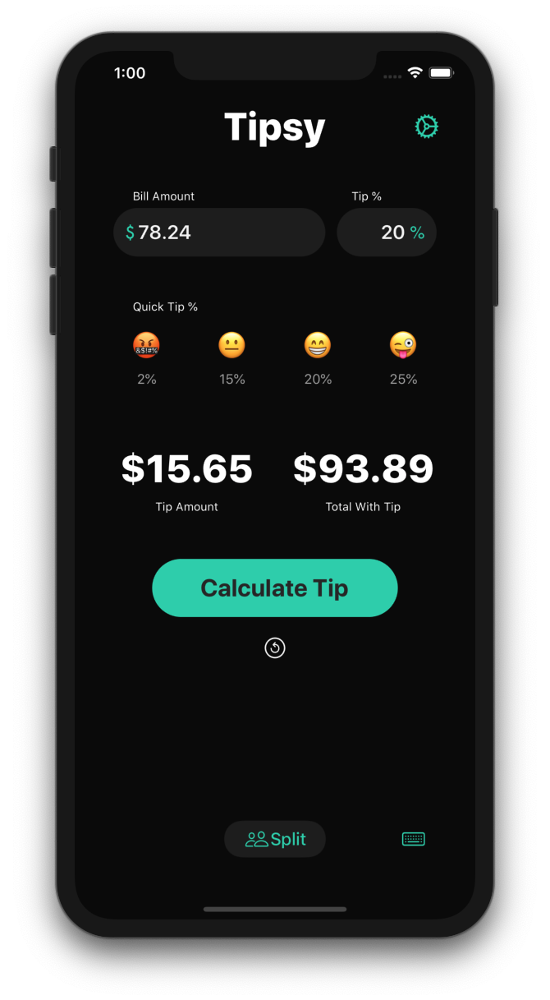

# Tipsy

Fun tip calculator with very clean and simple UI.

    

### Technologies Used:
- UIKit
- Contacts
- MessageUI
- Social

### Features:
- Calculate Tip
- Get split totals for sharing bill
- Ability to message your party with their portion of the bill
- Round dollar amounts up to nearest dollar
- Quick Tip Percentages
- Choose your own emoji icons for Quick Tip Percentages
- Supports iOS 13 Light & Dark modes

 
 
 
 
